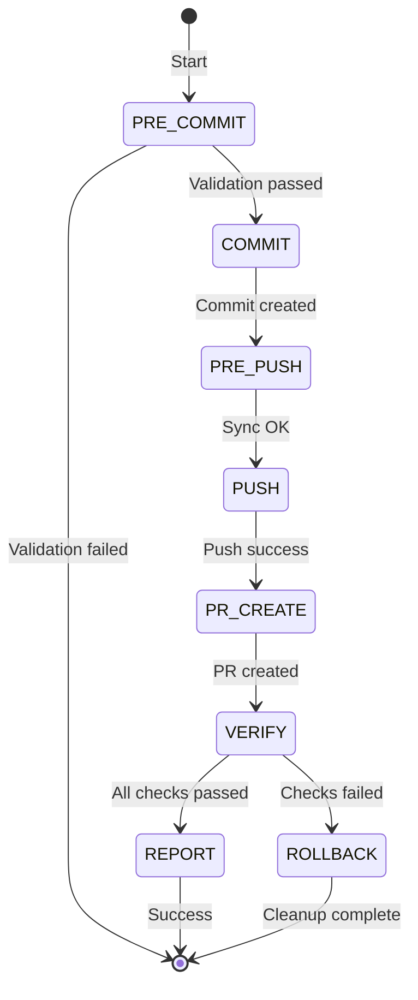

# Atomic Commit

Atomic workflow: validate → commit → push → PR → verify. All changes committed as single unit with **zero warnings** policy.

## Overview

Orchestrates complete code submission as state machine with 7 phases. Code quality gates pass before remote changes. **Warnings treated as failures** - all pre-existing issues must be resolved first.

## State Machine Phases



## Phase Details

### 1. PRE-COMMIT (Validation)
**Entry:** Uncommitted changes, on feature branch  
**Operations:**
```bash
./scripts/quality_gate.sh          # Must pass with zero warnings
git secrets scan 2>/dev/null || true  # No secrets in diff
```
**Success:** Quality gate exit 0, no secrets, not on protected branch  
**Fail Action:** Abort, no changes made

### 2. COMMIT (Atomic)
**Entry:** Pre-commit passed  
**Operations:**
```bash
git add -A
COMMIT_TYPE=$(detect_commit_type)  # feat|fix|docs|refactor|test|ci
git commit -m "$COMMIT_TYPE(scope): description"
```
**Success:** SHA created, conventional format  
**Rollback:** `git reset --soft HEAD~1 && git reset HEAD`

### 3. PRE-PUSH (Remote Sync)
**Entry:** Commit created  
**Operations:**
```bash
git fetch origin
# Check divergence: remote must be ancestor of local
git merge-base --is-ancestor origin/main HEAD
```
**Success:** Remote accessible, no conflicts, push permissions OK  
**Fail Action:** Abort with rebase instructions

### 4. PUSH (Upload)
**Entry:** Pre-push passed  
**Operations:**
```bash
git push -u origin HEAD
# Verify: local SHA == remote SHA
git rev-parse HEAD == git rev-parse origin/HEAD
```
**Success:** Push exit 0, SHAs match, tracking established  
**Rollback:** `git push origin +HEAD~1:branch` (best effort)

### 5. PR-CREATE (Open PR)
**Entry:** Push succeeded, `gh` authenticated  
**Operations:**
```bash
gh pr create --title "$(git log -1 --pretty=%s)" \
             --body "$(generate_pr_body)" \
             --base main
```
**Success:** Valid PR URL, meaningful body, correct base  
**Rollback:** `gh pr close $PR_NUMBER`

### 6. VERIFY (Wait for CI)
**Entry:** PR created  
**Operations:**
```bash
gh pr checks --watch --interval 10  # 30 min timeout
# Zero warnings: grep -qiE "(warning|warn:|deprecated)" = fail
```
**Success:** All checks green, zero warnings  
**Fail Action:** Trigger rollback

### 7. REPORT (Complete)
**Entry:** All checks passed  
**Operations:** Display success report with PR URL, time metrics, next steps

## Quality Gates (Zero Warnings)

| Gate | Check | Treatment |
|------|-------|-----------|
| Pre-Commit | Quality gate | Warnings = Failures |
| Lint | No warnings | Block commit |
| Test | 100% pass | Block push |
| Security | No vulnerabilities | Block PR |
| CI/CD | All green | Block completion |

**Policy:** Pre-existing issues must be fixed in separate PR first.

## Rollback Matrix

| Phase Failed | Rollback Actions |
|--------------|------------------|
| Pre-Commit | None |
| Commit | Unstage, remove local commit |
| Pre-Push | Remove local commit |
| Push | Remove remote commit (best effort), remove local |
| PR-Create | Close PR, remove commits |
| Verify | Close PR, remove commits |

## Commit Format

```
type(scope): Brief description (50 chars max)

- Why (not what) - user perspective
- Reference issues: Fixes #123
```

**Types:** feat, fix, docs, style, refactor, perf, test, ci, chore

## Usage

```bash
# Basic - auto-detect type, commit all, push, PR, verify
/atomic-commit

# With message
/atomic-commit --message "feat(auth): add OAuth2 flow"

# Dry run (validate only)
/atomic-commit --dry-run

# Skip CI (emergency)
/atomic-commit --skip-ci "Hotfix: security patch"
```

## Error Codes

| Code | Meaning |
|------|---------|
| 0 | Success |
| 1 | Generic failure |
| 2 | Quality gate failed |
| 3 | Commit failed |
| 4 | Push failed |
| 5 | PR creation failed |
| 6 | Checks failed/warnings found |
| 7 | Timeout |
| 8 | Rollback failed |

## Prerequisites

- `gh` CLI installed and authenticated
- Working on feature branch (not main/master)
- `./scripts/quality_gate.sh` exists
- Clean working directory or intentional changes

## Configuration

Environment variables:
```bash
ATOMIC_COMMIT_TIMEOUT=1800          # Check wait timeout (seconds)
ATOMIC_COMMIT_BASE_BRANCH=main     # Override base branch
ATOMIC_COMMIT_NO_ROLLBACK=0        # Set 1 to disable rollback
```

## Implementation

Scripts located in `scripts/atomic-commit/`:
- `run.sh` - Main orchestrator
- `validate.sh` - Pre-commit checks
- `commit.sh` - Atomic commit
- `push.sh` - Sync and push
- `create-pr.sh` - PR creation
- `verify.sh` - CI polling

## Troubleshooting

**Quality gate fails:** Run `./scripts/quality_gate.sh` manually. Fix all warnings.

**Push rejected:** Remote diverged. Workflow retries once after rebase.

**Checks timeout:** Verify GitHub Actions enabled. Use `--timeout` flag.

**"Warning treated as failure:** This is intentional. Fix the warning.

## Success Criteria

Command succeeds only when:
1. ✓ All local validation passes (zero warnings)
2. ✓ Commit created with valid SHA
3. ✓ Pushed to remote successfully
4. ✓ PR created with valid URL
5. ✓ All GitHub Actions pass
6. ✓ Zero warnings in all checks

## See Also

- `commit.md` - Basic commit guidelines
- `scripts/atomic-commit/run.sh` - Implementation
- `.github/PULL_REQUEST_TEMPLATE.md` - PR template
