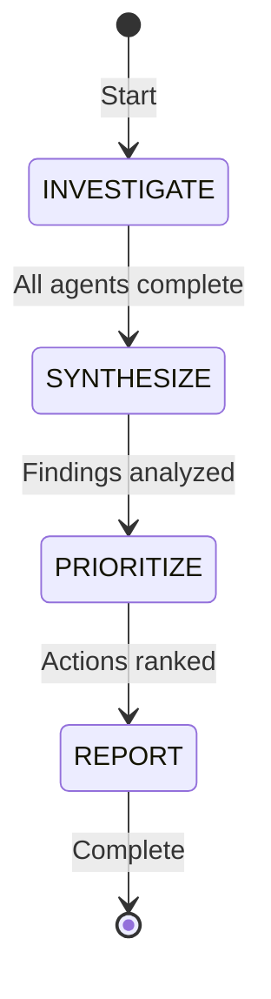

# Swarm Analysis

Multi-perspective codebase audit using coordinated agents. Identifies missing features, incomplete implementations, documentation gaps, missing evals, and inadequate test coverage.

## Overview

Orchestrates 6 specialized agents in parallel to comprehensively analyze the codebase from different perspectives. Each agent focuses on a specific domain, then findings are synthesized into actionable recommendations.

## When to Use

- New codebase onboarding - understand what's missing
- Pre-release audit - ensure completeness
- Technical debt assessment - identify gaps
- Contributing to unfamiliar code - find improvement areas
- Quarterly maintenance reviews

## State Machine



## Workflow

### Phase 1: Parallel Investigation (6 Agents)

Launch all agents simultaneously with specific focus:

```
subagent_type="explore"    → Missing features & capabilities
subagent_type="explore"    → Implementation completeness
subagent_type="explore"    → Documentation gaps
subagent_type="explore"    → Eval/evaluation coverage
subagent_type="explore"    → Test coverage & quality
subagent_type="explore"    → Architecture & patterns
```

### Phase 2: Synthesis

Combine findings, identify:
- Overlapping gaps (multiple agents flag same area)
- Unique issues (only one agent found)
- Dependencies between gaps
- Quick wins vs major work

### Phase 3: Prioritization

Rank by impact/effort:
1. **Critical** - Blocks usage, security, or core function
2. **High** - Significantly improves experience
3. **Medium** - Nice improvements, some effort
4. **Low** - Minor polish, easy wins

### Phase 4: Report

Deliver structured findings with action items.

## Agent Definitions

### Agent 1: Feature Analyst
**Focus**: Missing capabilities and features

**Prompt**:
```
Analyze this codebase for MISSING FEATURES and capabilities:

1. What functionality do users likely expect but doesn't exist?
2. What common patterns for this type of project are absent?
3. What integrations would make sense but aren't present?
4. What would improve developer experience?
5. Check README, issues, TODOs for planned but unimplemented features

Report:
- Feature name
- Why it's valuable
- Approximate effort (S/M/L)
- Suggested implementation approach
```

### Agent 2: Implementation Auditor
**Focus**: Incomplete or suboptimal implementations

**Prompt**:
```
Analyze this codebase for IMPLEMENTATION GAPS:

1. What functions/methods are stubs or TODOs?
2. What error handling is missing?
3. What edge cases aren't covered?
4. What code smells indicate incomplete work?
5. What performance optimizations are obvious but missing?

Report:
- Location (file/line)
- What's missing
- Why it matters
- Suggested fix
```

### Agent 3: Documentation Inspector
**Focus**: Documentation completeness and quality

**Prompt**:
```
Analyze this codebase for DOCUMENTATION GAPS:

1. What public APIs lack documentation?
2. What complex logic lacks comments?
3. What setup instructions are missing or outdated?
4. What architecture decisions aren't explained?
5. Check: README, API docs, inline comments, CHANGELOG

Report:
- What needs documentation
- Documentation type needed
- Priority level
```

### Agent 4: Evaluations Reviewer
**Focus**: Missing or insufficient evals (for AI/ML projects)

**Prompt**:
```
Analyze this codebase for EVALUATION GAPS:

1. What skills/agents lack evals/ folder?
2. What evals exist but have insufficient coverage?
3. What critical paths lack evaluation?
4. What edge cases aren't tested in evals?
5. Check: .agents/skills/*/evals/, test structure

Report:
- Missing eval locations
- Suggested eval scenarios
- Test case ideas
```

### Agent 5: Test Coverage Analyst
**Focus**: Test gaps and quality

**Prompt**:
```
Analyze this codebase for TEST GAPS:

1. What code lacks unit tests?
2. What integration tests are missing?
3. What error paths aren't tested?
4. What would benefit from property-based tests?
5. Check: test directories, coverage reports, CI config

Report:
- Untested components
- Test type needed
- Estimated effort
```

### Agent 6: Architecture Reviewer
**Focus**: Structural improvements and patterns

**Prompt**:
```
Analyze this codebase for ARCHITECTURAL IMPROVEMENTS:

1. What design patterns would improve maintainability?
2. What coupling should be reduced?
3. What abstractions are missing?
4. What would improve extensibility?
5. Check: module structure, dependencies, interfaces

Report:
- Architectural issue
- Proposed improvement
- Migration approach
```

## Execution

### Quick Run

```bash
# Analyze entire codebase
/swarm-analyze

# Analyze specific directory
/swarm-analyze --path ./src

# Focus on specific areas
/swarm-analyze --focus features,tests
```

### Implementation Steps

1. **Load agent-coordination skill** for swarm patterns
2. **Execute Phase 1**: Launch 6 agents in parallel
3. **Wait for completion**: All agents return findings
4. **Execute Phase 2**: Synthesize results
5. **Execute Phase 3**: Prioritize actions
6. **Generate report**: Structured markdown output

## Synthesis Template

```markdown
# Swarm Analysis Results

## Executive Summary
- **Total Gaps Found**: [N]
- **Critical**: [N] | **High**: [N] | **Medium**: [N] | **Low**: [N]
- **Categories**: Features [N], Implementation [N], Docs [N], Evals [N], Tests [N], Architecture [N]

## Confirmed by Multiple Agents
| Gap | Agents | Priority |
|-----|--------|----------|
| [Description] | Feature + Impl + Test | Critical |

## Feature Gaps
| Feature | Value | Effort | Suggested Approach |
|---------|-------|--------|-------------------|
| [Name] | High | Medium | [Approach] |

## Implementation Gaps
| Location | Issue | Fix | Priority |
|----------|-------|-----|----------|
| file.ts:42 | Missing error handling | Add try/catch | High |

## Documentation Gaps
| What | Type Needed | Priority |
|------|-------------|----------|
| API X | JSDoc | Medium |

## Evaluation Gaps
| Location | Missing Scenarios | Priority |
|----------|-------------------|----------|
| skill Y/evals/ | Edge case Z | High |

## Test Gaps
| Component | Test Type | Priority |
|-----------|-----------|----------|
| Module A | Unit tests | Critical |

## Architectural Improvements
| Issue | Improvement | Migration |
|-------|-------------|-----------|
| Tight coupling | Extract interface | Gradual |

## Quick Wins (Low effort, high impact)
1. [Action 1]
2. [Action 2]

## Recommended Action Plan
### Week 1: Critical Fixes
- [ ] Fix critical gap 1
- [ ] Add missing evals for skill X

### Month 1: High Priority
- [ ] Implement feature Y
- [ ] Add test coverage for Z

### Quarter: Strategic Improvements
- [ ] Architecture refactoring
- [ ] Documentation overhaul
```

## Quality Criteria

- [ ] All 6 agents completed analysis
- [ ] Findings synthesized with overlap identified
- [ ] Priorities assigned (Critical/High/Medium/Low)
- [ ] Quick wins identified
- [ ] Actionable recommendations provided
- [ ] Effort estimates included

## Example Usage

### Example 1: New Skill Audit
```
Goal: Check new skill for completeness before release

Phase 1:
- Feature: Check all required SKILL.md sections
- Implementation: Verify scripts work correctly
- Docs: Check reference/ folder completeness
- Evals: Verify evals/ folder exists with cases
- Tests: Check test coverage
- Architecture: Review skill structure

Phase 2 Synthesis:
- Missing: reference/ folder, only 2 evals
- Incomplete: error handling in main script
- Quick win: Add CHANGELOG.md

Phase 3 Actions:
- Add reference/API.md (Medium)
- Add 5 more eval cases (High)
- Add error handling (High)
```

### Example 2: Repository Health Check
```
Goal: Quarterly assessment of main repo

Phase 1:
All 6 agents analyze entire codebase

Phase 2:
- 12 gaps found, 2 critical (security-related)
- 3 features requested in issues but not implemented
- 4 skills missing evals entirely

Phase 3:
Prioritize security fixes first, then feature implementation
```

## Error Handling

**Agent timeout**: Extend timeout or reduce scope
**Conflicting findings**: Note both perspectives, defer to maintainer
**No gaps found**: Re-run with different focus or celebrate

## See Also

- `.agents/skills/agent-coordination/SKILL.md` - Coordination patterns
- `.agents/skills/agent-coordination/SWARM.md` - Swarm methodology
- `agents-docs/SUB-AGENTS.md` - Sub-agent patterns
