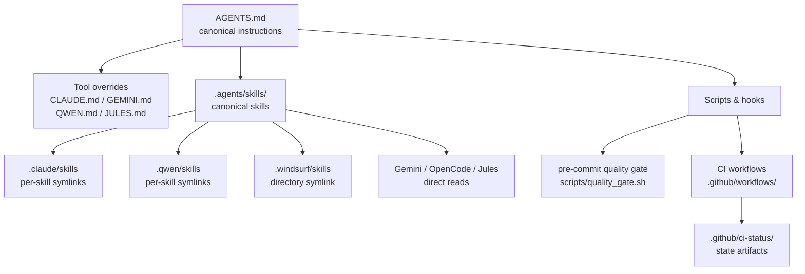
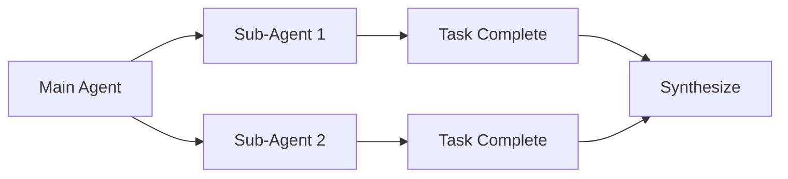

# GitHub Template AI Agents

> Opinionated GitHub template for teams who want reproducible, multi-agent software
> delivery with shared instructions, quality gates, and low-context-rot workflows.

[](LICENSE)
[](CHANGELOG-TEMPLATE.md)
[](CONTRIBUTING.md)

**Best for:** maintainers who use Claude Code, Gemini CLI, OpenCode, Qwen Code, Jules,
Windsurf, Copilot Chat, or mixed agent stacks in the same repository.

**This template gives you:**

- One canonical instruction source via `AGENTS.md`
- Reusable, versioned skills in `.agents/skills/`
- Tool-specific compatibility layers — not duplicated agent logic
- Commit-time and CI-time quality enforcement
- Patterns for sub-agents, task delegation, and context isolation

**Quick Links:** [Quick Start](#quick-start) · [Why this template](#why-this-template)
· [Agent compatibility](#agent-compatibility) · [Architecture](#architecture)
· [Adoption paths](#adoption-paths) · [Documentation](#documentation)

---

## Why this template

Most AI coding setups break down in one of three ways:

- Instructions drift across tool-specific files and diverge over time
- Quality checks happen too late (post-PR, or not at all)
- Long agent sessions accumulate noisy context and produce inconsistent changes

This template addresses each problem with an opinionated default:

| Problem | Typical setup | This template |
|---|---|---|
| Shared agent instructions | Duplicated `.md` files per tool | `AGENTS.md` → canonical source, thin tool overrides |
| Reusable domain knowledge | Prompt snippets copied between chats | Versioned skills in `.agents/skills/` |
| Tool compatibility | Separate hand-maintained config per agent | Symlinks + override files per tool |
| Quality enforcement | Manual or post-PR only | Pre-commit hook + CI quality gate |
| Long-session context drift | Monolithic prompts | Sub-agent and delegation patterns |

Use this template when you want a repository structure that survives:

- Model version changes
- Adding a second or third AI tool to your workflow
- Team growth beyond a single maintainer

## Agent compatibility

| Tool | Root config | Skills source | Integration style |
|---|---|---|---|
| **Claude Code** | `CLAUDE.md` | `.claude/skills/` → individual symlinks to `.agents/skills/` | Override file + per-skill symlinks |
| **Qwen Code** | `QWEN.md` | `.qwen/skills/` → individual symlinks to `.agents/skills/` | Override file + per-skill symlinks |
| **Gemini CLI** | `GEMINI.md` + `.gemini/config.yaml` | `.agents/skills/` (direct read) | Override file + direct canonical path |
| **OpenCode** | `opencode.json` | `.agents/skills/` (direct read) | JSON config + direct canonical path |
| **Jules** | `JULES.md` + `.jules/*.md` | `.agents/skills/` (direct read) | Override file + direct canonical path |
| **Windsurf** | `.windsurf/` | `.windsurf/skills` → directory symlink to `.agents/skills/` | Directory config + directory symlink |
| **Copilot Chat** | `AGENTS.md` | Via repo docs | Best-effort structured compatibility |

All tools share the same canonical instruction source (`AGENTS.md`) and canonical skills
directory (`.agents/skills/`). Tool-specific files contain only true overrides — never
duplicated instructions.

## Architecture



> **Rule:** `AGENTS.md` is the only place shared instructions live.
> Tool files extend or override; they never duplicate.

## Adoption paths

| Starting point | Recommended first step |
|---|---|
| **New repository** | Use this template directly — all structure is in place |
| **Existing repo, one AI tool** | Add `AGENTS.md` first, then migrate reusable prompts into `.agents/skills/` |
| **Existing repo, multiple agent files** | Consolidate shared instructions into `AGENTS.md`; keep only true tool-specific overrides |
| **Existing repo, flaky automation** | Start with `quality_gate.sh` + CI status artifacts before expanding agent workflows |

See [agents-docs/MIGRATION.md](agents-docs/MIGRATION.md) for step-by-step migration guides.

## What this looks like in practice

### Canonical instruction source (`AGENTS.md`)

```md
# AGENTS.md

## Development Phases

We use a GOAP approach combined with ADRs and TRIZ for structured development.

## Quality Gate (Required Before Commit)

Use the `static-analysis` skill to triage and fix any findings before committing.

## Code Style

- Max 500 lines/file; 250/SKILL.md; 200/AGENTS.md
- No hardcoded values: use relative paths, runtime derivation, env vars
```

### A skill directory (`.agents/skills/task-decomposition/`)

```text
.agents/skills/task-decomposition/
└── SKILL.md        ← instructions for breaking complex tasks into atomic goals
```

`SKILL.md` contains focused, reusable instructions for one domain.
Agents load individual skills on demand rather than injecting everything at once.

### CI state artifact (`.github/ci-status/ci-status.json`)

```json
{
  "status": "passing",
  "last_run": "2026-06-05T16:47:55Z",
  "failing_jobs": [],
  "workflow_url": "https://github.com/.../actions/runs/27027831423"
}
```

Agents read this artifact to understand the current CI state before proposing changes,
avoiding suggestions that fix one check while breaking another.

## Quick Start

```bash
git clone https://github.com/your-org/your-project.git
cd your-project
./scripts/bootstrap.sh
```

See [QUICKSTART.md](QUICKSTART.md) for prerequisites, troubleshooting, and per-tool
verification steps. If bootstrap fails, run `./scripts/doctor.sh` for diagnostics.

## Core Concepts

### Single Source of Truth

All agents read from `AGENTS.md` — CLI-specific files (`CLAUDE.md`, `GEMINI.md`,
`QWEN.md`, `JULES.md`) contain only overrides.

```text
AGENTS.md → Single source of truth
├── CLAUDE.md → Overrides only (@AGENTS.md)
├── GEMINI.md → Overrides only (@AGENTS.md)
├── QWEN.md   → Overrides only (@AGENTS.md)
└── opencode.json → Configuration
```

### Skills with Progressive Disclosure

Skills live canonically in `.agents/skills/`. Claude Code and Qwen Code use per-skill
symlinks; Windsurf uses a directory symlink; Gemini CLI, OpenCode, and Jules read
directly from `.agents/skills/`:

```text
.agents/skills/           # Canonical source (single location)
├── task-decomposition/
├── shell-script-quality/
└── github-readme/

.claude/skills/           # Per-skill symlinks → ../../.agents/skills/<skill>
.qwen/skills/             # Per-skill symlinks → ../../.agents/skills/<skill>
.windsurf/skills          # Directory symlink → ../.agents/skills
```

### Sub-Agent Patterns

Delegate isolated tasks to sub-agents for context isolation:



## Documentation

- [AGENTS.md](AGENTS.md) — main agent instructions (single source of truth)
- [Quick Start](QUICKSTART.md) — setup, troubleshooting, per-tool verification
- [Harness Overview](agents-docs/HARNESS.md) — architecture and patterns
- [Skills Guide](agents-docs/SKILLS.md) — creating reusable skills
- [Sub-Agents](agents-docs/SUB-AGENTS.md) — context isolation patterns
- [Hooks](agents-docs/HOOKS.md) — pre/post tool hooks
- [Context](agents-docs/CONTEXT.md) — back-pressure mechanisms
- [Migration](agents-docs/MIGRATION.md) — adopting in existing projects
- [Available Skills](.agents/skills/README.md) — agents skills overview

## Contributing

We welcome contributions! See our [Contributing Guide](CONTRIBUTING.md) for:

- Development environment setup
- Good first issues
- Code style and testing requirements
- Pull request process

## Community

- [Issue Tracker](https://github.com/d-o-hub/github-template-ai-agents/issues) — report bugs
- [Discussions](https://github.com/d-o-hub/github-template-ai-agents/discussions) — ask questions

## License

This project is licensed under the [MIT License](LICENSE) — see the LICENSE file
for details.

---

**Built with AI agents. Maintained by humans.**
