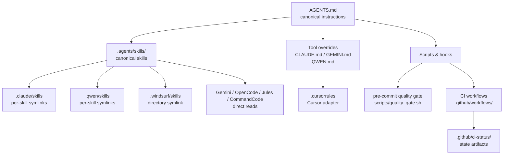
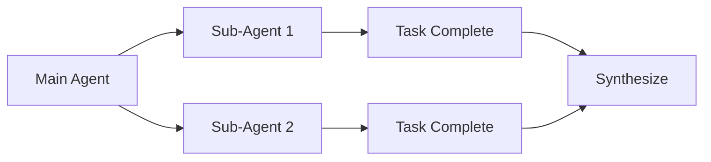

# GitHub Template AI Agents

> Opinionated GitHub template for teams who want reproducible, multi-agent software
> delivery with shared instructions, quality gates, and low-context-rot workflows.

[](LICENSE)
[](.template/CHANGELOG-TEMPLATE.md)
[](CONTRIBUTING.md)

**Best for:** maintainers who use Claude Code, Gemini CLI, OpenCode, Qwen Code, Jules,
Windsurf, Cursor, Copilot Chat, or mixed agent stacks in the same repository.

**Adopter default:** choose Minimal or Standard and use Light process mode.
This repository runs the Full **template maintainer** suite; a product does not
need its telemetry, historical plans, or automation to use shared instructions
and skills. Start with [Adoption profiles](agents-docs/ADOPTION_PROFILES.md).

**This template gives you:**

- One canonical instruction source via `AGENTS.md`
- Reusable, versioned skills in `.agents/skills/`
- Tool-specific compatibility layers — not duplicated agent logic
- Commit-time and CI-time quality enforcement
- Patterns for sub-agents, task delegation, and context isolation

**Quick Links:** [Quick Start](#quick-start) · [Why this template](#why-this-template)
· [Agent compatibility](#agent-compatibility) · [Architecture](#architecture)
· [Adoption paths](#adoption-paths) · [Documentation](#documentation)

---

## Why this template

Most AI coding setups break down in one of three ways:

- Instructions drift across tool-specific files and diverge over time
- Quality checks happen too late (post-PR, or not at all)
- Long agent sessions accumulate noisy context and produce inconsistent changes

This template addresses each problem with an opinionated default:

- ✓ **Multi-Agent Support**: Works with 7+ AI coding tools simultaneously
- ✓ **Skills System**: Reusable knowledge modules in canonical location
- ✓ **Quality Gates**: Automatic lint, test, format before commits
- ✓ **Optional CI State Artifacts**: `.github/ci-status/ci-status.json` and `.github/ci-status/ci-summary.md` provide advisory CI health for agents
- ✓ **Context Discipline**: Prevents context rot with sub-agents and hooks
- ✓ **Dependabot Integration**: Automated security and version updates

| Problem | Typical setup | This template |
|---|---|---|
| Shared agent instructions | Duplicated `.md` files per tool | `AGENTS.md` → canonical source, thin tool overrides |
| Reusable domain knowledge | Prompt snippets copied between chats | Versioned skills in `.agents/skills/` |
| Tool compatibility | Separate hand-maintained config per agent | Symlinks + override files per tool |
| Quality enforcement | Manual or post-PR only | Pre-commit hook + CI quality gate |
| Long-session context drift | Monolithic prompts | Sub-agent and delegation patterns |

Use this template when you want a repository structure that survives:

- Model version changes
- Adding a second or third AI tool to your workflow
- Team growth beyond a single maintainer

## Agent compatibility

| Tool | Root config | Skills source | Integration style |
|---|---|---|---|
| **Claude Code** | `CLAUDE.md` | `.claude/skills/` → individual symlinks to `.agents/skills/` | Override file + per-skill symlinks |
| **Qwen Code** | `QWEN.md` | `.qwen/skills/` → individual symlinks to `.agents/skills/` | Override file + per-skill symlinks |
| **Gemini CLI** | `GEMINI.md` + `.gemini/config.yaml` | `.agents/skills/` (direct read) | Override file + direct canonical path |
| **OpenCode** | `opencode.json` | `.agents/skills/` (direct read) | JSON config + direct canonical path |
| **Windsurf** | `.windsurf/` | `.windsurf/skills` → directory symlink to `.agents/skills/` | Directory config + directory symlink |
| **CommandCode** | `.commandcode/` | `.agents/skills/` (direct read) | Directory config + taste learning |
| **Cursor** | `.cursorrules` | `.cursor/rules.md` | Override file + rules adapter |
| **Copilot Chat** | `AGENTS.md` | Via repo docs | Best-effort structured compatibility |

All tools share the same canonical instruction source (`AGENTS.md`) and canonical skills
directory (`.agents/skills/`). Tool-specific files contain only true overrides — never
duplicated instructions.

## Architecture


```mermaid
flowchart TD
    A["AGENTS.md<br/>canonical instructions"] --> B["Tool overrides<br/>CLAUDE.md / GEMINI.md<br/>QWEN.md"]
    A --> C[".agents/skills/<br/>canonical skills"]
    C --> D[".claude/skills<br/>per-skill symlinks"]
    C --> E[".qwen/skills<br/>per-skill symlinks"]
    C --> F[".windsurf/skills<br/>directory symlink"]
    C --> G["Gemini / OpenCode / Jules / CommandCode<br/>direct reads"]
    B --> H[".cursorrules<br/>Cursor adapter"]
    A --> I["Scripts & hooks"]
    I --> J["pre-commit quality gate<br/>scripts/quality_gate.sh"]
    I --> K["CI workflows<br/>.github/workflows/"]
    K --> L[".github/ci-status/<br/>state artifacts"]
```

> **Rule:** `AGENTS.md` is the only place shared instructions live.
> Tool files extend or override; they never duplicate.

## Adoption paths

| Profile | Default process | Intended scope |
|---|---|---|
| **Minimal** | Light | Product instructions, a product quality gate, basic CI |
| **Standard** | Light | Minimal + selected skills, hooks, and agent workflows |
| **Full** | Full | This template's maintenance, generators, metrics/DORA, and CI-status automation |

Light means understand → change → verify → report. Architectural changes still
need a proportionate plan/decision record; larger tasks can use ADR/TRIZ/GOAP
without adopting the entire Full stack. No mode makes an implementation request
permission to commit, push, open/close PRs or issues, or merge.

| Starting point | Recommended first step |
|---|---|
| **New repository** | Create from the template, choose a profile, then customize product docs and checks |
| **Existing repo, one AI tool** | Add `AGENTS.md` first, then migrate reusable prompts into `.agents/skills/` |
| **Existing repo, multiple agent files** | Consolidate shared instructions into `AGENTS.md`; keep only true tool-specific overrides |
| **Existing repo, flaky automation** | Start with reliable product checks; add CI-status artifacts only if useful |

Follow the [adopter cleanup checklist](agents-docs/ADOPTION_PROFILES.md#adopter-cleanup-checklist)
for copied CI-status history, per-agent/legacy metrics and DORA, old plans,
product README/version policy, tool configs, and rulesets. This is downstream
cleanup, not deletion of the current template's maintainer artifacts. See
[Migration](agents-docs/MIGRATION.md) for existing repositories.

### Customize CI and versioning

The supplied CI is an example multi-language/template suite, not inferred
product CI. Replace install/test commands and local gates for your stack.
Node CI assumes `npm ci` / `npm test`; pnpm, Yarn, and Bun products must adapt
package-manager setup, lockfiles/caches, and commands. Remove optional workflows
carefully, updating required checks and triggers rather than adding generic
`if: false` guards. CI-status producer steps are embedded in `ci.yml`; deleting
the status JSON or cleanup workflow alone does not disable them. Details:
[Adoption Profiles](agents-docs/ADOPTION_PROFILES.md#product-ci-not-inferred-ci).

Here `VERSION=0.0.0` is a consumer placeholder. Template releases live in
[`.template/CHANGELOG-TEMPLATE.md`](.template/CHANGELOG-TEMPLATE.md), reflected by
the template badge above. Downstream `VERSION` is the product's source of truth;
release scripts need deliberate adaptation. The patch-bump script does not
reset the value. See [Version Flow](agents-docs/template-versioning/version-flow.md).

## What this looks like in practice

### Canonical instruction source (`AGENTS.md`)

```md
# AGENTS.md

## Process

Use Light mode: understand → change → verify → report.
Plan architectural changes with a proportionate decision record.
Delegate retrieval → planning → implementation → verification.
Commit/push/PR/merge only when requested.

## Quality Gate (Required Before Commit)

Run the product's lint/typecheck/tests before an authorized commit.
Use `static-analysis` to triage findings; report skipped checks.

## Code Style

- Max 500 lines/file; 250/SKILL.md; 200/AGENTS.md
- No hardcoded values: use relative paths, runtime derivation, env vars
```

### A skill directory (`.agents/skills/goap-agent/`)

```text
.agents/skills/goap-agent/
└── SKILL.md        ← instructions for breaking complex tasks into atomic goals
```

`SKILL.md` contains focused, reusable instructions for one domain.
Agents load individual skills on demand rather than injecting everything at once.
Optional packs are product choices, not synonyms for the eight default-unlinked
Claude/Qwen skills. Consult [Adoption Profiles](agents-docs/ADOPTION_PROFILES.md#default-unlinked-skills-are-a-separate-mechanism)
for the current link policy. When pruning downstream skills, update the curated
`AGENTS.md` inventory and run all affected generators, not only symlink setup.

**Static validation ≠ behavioral proof.** Skill structure, eval schema, fixture,
and smoke-run checks do not invoke a model or establish skill effectiveness.
Low-impact docs need relevant inventory/link/Markdown checks; behavioral claims
need representative behavioral evals and honest reporting of skipped scenarios.

### CI state artifact (`.github/ci-status/ci-status.json`)

```json
{
  "schema_version": 3,
  "status": "unknown",
  "last_run": "2026-09-27T16:03:22Z",
  "validated": false,
  "failing_jobs": [],
  "skipped_jobs": ["test"],
  "allowed_skips": [],
  "unallowed_skips": ["test"],
  "cancelled_jobs": [],
  "timed_out_jobs": [],
  "unknown_jobs": [],
  "succeeded_jobs": ["quality-gate"],
  "advisory_only": true,
  "workflow_url": "https://github.com/.../actions/runs/36331732554"
}
```

`status` is tri-state — `passing`, `failing`, or `unknown`. `passing` certifies
the tracked checks only under the artifact's contract, not permission to merge.
A job skipped by an `if:` condition reports `Success` on GitHub and does not
block a merge even as a required check. An unallowlisted required-job skip
therefore yields `unknown`, as above, rather than proof that tests passed.

The artifact is **advisory**: a committed file is not a merge gate, so anyone
with write permission can set any status. Agents read it as a fast signal and
should confirm the actual repository/run. Adopters remove or regenerate copied
template state rather than treating it as their own CI evidence. Full contract:
[`agents-docs/CI_STATUS.md`](agents-docs/CI_STATUS.md).

## Quick Start

```bash
# Evaluating this template itself (Full suite):
git clone https://github.com/d-o-hub/github-template-ai-agents.git
cd github-template-ai-agents

# Bootstrap creates skill links and configures local git hooks.
./scripts/bootstrap.sh
```

For a product, create and clone **your** repository instead, choose
Minimal/Standard, and customize its docs/checks before treating setup as product
verification. Bootstrap is deliberate template-tooling setup, not a product
dependency installer.

See [QUICKSTART.md](QUICKSTART.md) for prerequisites, troubleshooting, and per-tool
verification steps. If bootstrap fails, run `./scripts/doctor.sh` for diagnostics.

## Core Concepts

### Single Source of Truth

All agents read from `AGENTS.md` — CLI-specific files (`CLAUDE.md`, `GEMINI.md`,
`QWEN.md`, `.cursorrules`) contain only overrides.

```text
AGENTS.md → Single source of truth
├── CLAUDE.md → Overrides only (@AGENTS.md)
├── GEMINI.md → Overrides only (@AGENTS.md)
├── QWEN.md   → Overrides only (@AGENTS.md)
├── .cursorrules → Cursor adapter
└── opencode.json → Configuration
```

### Skills with Progressive Disclosure

Skills live canonically in `.agents/skills/`. Claude Code and Qwen Code use per-skill
symlinks; Windsurf uses a directory symlink; Gemini CLI, OpenCode, and Jules read
directly from `.agents/skills/`:

```text
.agents/skills/           # Canonical source (single location)
├── goap-agent/
├── shell-script-quality/
└── readme-best-practices/

.claude/skills/           # Per-skill symlinks → ../../.agents/skills/<skill>
.qwen/skills/             # Per-skill symlinks → ../../.agents/skills/<skill>
.windsurf/skills          # Directory symlink → ../.agents/skills
```

### Sub-Agent Patterns

Delegate isolated tasks to sub-agents for context isolation:


```mermaid
graph LR
    A[Main Agent] --> B[Sub-Agent 1]
    A --> C[Sub-Agent 2]
    B --> D[Task Complete]
    C --> E[Task Complete]
    D --> F[Synthesize]
    E --> F
```

Order dependent work as retrieval → planning → implementation → verification;
parallelize only independent tasks. Full metrics/DORA and inherited-failure
remediation are not Light defaults. For requested GitHub triage, assess adopter
value—including consumed metadata, catalogs, safety, and automation—not just
source-code changes. Do not close consumed metadata updates as “no impact.”
See [Behavioral Defaults](agents-docs/BEHAVIORAL_DEFAULTS.md).

## Documentation

- [AGENTS.md](AGENTS.md) — main agent instructions (single source of truth)
- [EVALS.md](.template/EVALS.md) — (Template) Agent quality and performance tracking
- [USE_RESTRICTIONS.md](.template/USE_RESTRICTIONS.md) — (Template) Agent usage policies
- [Quick Start](QUICKSTART.md) — setup, troubleshooting, per-tool verification
- [Harness Overview](agents-docs/HARNESS.md) — architecture and patterns
- [Skills Guide](agents-docs/SKILLS.md) — creating reusable skills
- [Sub-Agents](agents-docs/SUB-AGENTS.md) — context isolation patterns
- [Hooks](agents-docs/HOOKS.md) — pre/post tool hooks
- [Context](agents-docs/CONTEXT.md) — back-pressure mechanisms
- [Migration](agents-docs/MIGRATION.md) — adopting in existing projects
- [Adoption profiles](agents-docs/ADOPTION_PROFILES.md) — minimal CI, skill packs, light process
- [Available Skills](.agents/skills/README.md) — agents skills overview
- [Monorepo Example](examples/monorepo-bun-turbo/README.md) — Bun + Turbo project structure

## Contributing

We welcome contributions! See our [Contributing Guide](CONTRIBUTING.md) for:

- Development environment setup
- Good first issues
- Code style and testing requirements
- Pull request process

## Community

- [Issue Tracker](https://github.com/d-o-hub/github-template-ai-agents/issues) — report bugs
- [Discussions](https://github.com/d-o-hub/github-template-ai-agents/discussions) — ask questions

## License

This project is licensed under the [MIT License](LICENSE) — see the LICENSE file
for details.

---

**Built with AI agents. Maintained by humans.**
