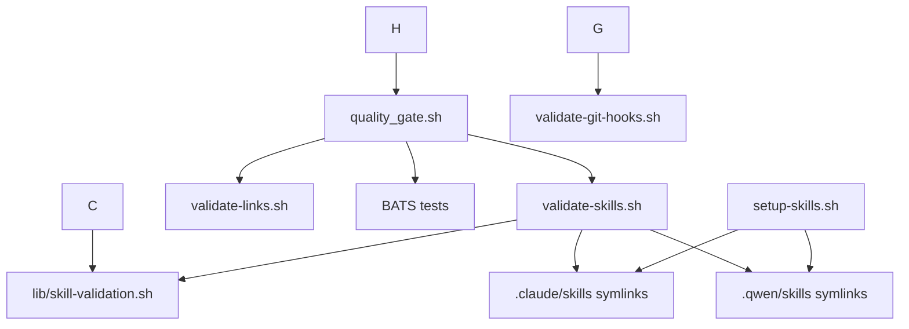

# Scripts Reference

> All scripts in `scripts/` with their purpose, usage, and dependencies.
> Keep this file updated when adding or removing scripts.

## Core Scripts

| Script | Purpose | Usage |
|--------|---------|-------|
| `agent-toolkit.sh` | Unified CLI — wraps all scripts under one command | `./bin/agent-toolkit help` |
| `bootstrap.sh` | Single-command first-time setup (skills + hook + validate + gate) | `./scripts/bootstrap.sh` |
| `doctor.sh` | Environment diagnostics for self-service troubleshooting | `./scripts/doctor.sh` |
| `quality_gate.sh` | Multi-language quality gate (lint, test, format) | `./scripts/quality_gate.sh` |
| `minimal_quality_gate.sh` | Fast-path quality gate for CI debugging | `./scripts/minimal_quality_gate.sh` |
| `setup-skills.sh` | Create symlinks from `.agents/skills/` to CLI dirs (prunes dangling/orphan/`*-workspace` links) | `./scripts/setup-skills.sh` |
| `persist-ci-status.sh` | Commit the CI status artifacts and converge them onto the default branch | `./scripts/persist-ci-status.sh` |
| `update-all-docs.sh` | Orchestrate documentation regeneration and command verification (`--dry-run` supported) | `./scripts/update-all-docs.sh [--dry-run]` |

## Validation Scripts

| Script | Purpose | Usage |
|--------|---------|-------|
| `validate-skills.sh` | Validate skill symlinks and SKILL.md files | `./scripts/validate-skills.sh` |
| `validate-git-hooks.sh` | Check git hooks configuration | `./scripts/validate-git-hooks.sh` |
| `validate-links.sh` | Validate markdown links are not broken | `./scripts/validate-links.sh` |
| `validate-config.sh` | Validate `.command-verify.conf` (command-verification settings) | `./scripts/validate-config.sh` |
| `validate-workflows.sh` | Validate JavaScript blocks in workflows via `node -c`, and scan for script-injection risks | `./scripts/validate-workflows.sh` |
| `validate-github-actions-shas.sh` | Verify every external action is pinned to a real 40-character commit SHA | `./scripts/validate-github-actions-shas.sh` |
| `yaml_validate_workflows.py` | CI guard against YAML scalar-dedent regressions (the F8-class bug) | `python3 scripts/yaml_validate_workflows.py` |
| `validate_gemini_toml.py` | Validate Gemini CLI `.toml` command files carry their required fields | `python3 scripts/validate_gemini_toml.py` |
| `check-adr-compliance.sh` | Verify ADRs are registered in `plans/_status.json` and match project patterns | `./scripts/check-adr-compliance.sh` |
| `check-plan-numbering.sh` | Verify `plans/` numbering stays consistent and reports the next free plan/ADR id | `./scripts/check-plan-numbering.sh` |
| `check-skill-overlap.sh` | Keyless Tier-2 inter-skill similarity (5-gram Jaccard over `SKILL.md` bodies); `--strict` gates | `./scripts/check-skill-overlap.sh [--strict]` |
| `verify-commands.sh` | Verify slash commands referenced by agents actually resolve | `./scripts/verify-commands.sh` |
| `discover-commands.sh` | Extract every command from every agent config into one JSON inventory (single awk pass) | `./scripts/discover-commands.sh [-o file] [-f json]` |
| `eval-skills.sh` | Static schema + input-fixture audit of `evals/evals.json`; gates in `quality_gate.sh` | `./scripts/eval-skills.sh` |
| `check_ci_status_freshness.sh` | Validate `.github/ci-status/ci-status.json` schema v3, self-consistency, freshness, and optional `gh run list` parity | `./scripts/check_ci_status_freshness.sh` |
| `update-ci-status.py` | Derive the tri-state CI status artifact; `--check` is the fail-closed gate | `python3 scripts/update-ci-status.py [--check]` |
| `loc_gate.sh` | Enforce the per-file line limits declared in `AGENTS.md` | `./scripts/loc_gate.sh` |
| `wasm_size_gate.sh` | Enforce WASM binary size limits | `./scripts/wasm_size_gate.sh` |
| `check-skill-references.sh` | Fail when a live agent/skill surface references a folded skill name (`scripts/lib/folded-skills.tsv`) | `./scripts/check-skill-references.sh` |
| `check-agents-md-skills.sh` | Verify the AGENTS.md skill table matches `.agents/skills/` (the table is hand-curated, so it is checked, not generated) | `./scripts/check-agents-md-skills.sh` |
| `check-lessons-consistency.sh` | Fail when `LESSONS.md`, `lessons.jsonl` and `self-learning-rules.md` disagree on which lessons exist | `./scripts/check-lessons-consistency.sh` |
| `secretlint_gate.sh` | Runs secretlint | `./scripts/secretlint_gate.sh` |
| `detect-duplicate-prs.sh` | Detect and defuse duplicate open PRs (ADR-035 guard) | `./scripts/detect-duplicate-prs.sh` |
| `cleanup-ci-status-prs.sh` | Close stale bot PRs; dry-run uses the same identity/age selector | `./scripts/cleanup-ci-status-prs.sh --dry-run` |

## Commit and Version Scripts

| Script | Purpose | Usage |
|--------|---------|-------|
| `ai-commit.sh` | Build a valid conventional commit message for an agent | `./scripts/ai-commit.sh --type <type> [--scope <scope>] --subject <subject>` |
| `validate-commit-message.sh` | Validate a commit message file against commitlint | `./scripts/validate-commit-message.sh <commit-msg-file>` |
| `normalize-metrics-timestamps.sh` | Normalize `.agents/metrics/*.jsonl` timestamps to `YYYY-MM-DDTHH:MM:SSZ` | `./scripts/normalize-metrics-timestamps.sh` |
| `propagate-version.sh` | Propagate `VERSION` to every file that references it (general-purpose; see `agents-docs/TEMPLATE_VERSIONING.md`) | `./scripts/propagate-version.sh` |
| `bump_patch_version.sh` | Bump the patch version and append a changelog entry (general-purpose consumer utility — **do not run in this repo**, see `TEMPLATE_VERSIONING.md`) | `./scripts/bump_patch_version.sh` |
| `commit-msg-hook.sh` | Git `commit-msg` hook; enforces commitlint | Installed by `bootstrap.sh` |
| `pre-commit-hook.sh` | Pre-commit hook template (legacy; `.githooks/` is active) | Via `bootstrap.sh` |
| `post-commit-docs-sync.sh` | Post-commit hook that lists changed markdown for the `docs-hook` skill | Installed by `bootstrap.sh` |
| `sha-pin-actions.sh` | SHA-pin GitHub Actions across workflow files | `./scripts/sha-pin-actions.sh [workflow-file]` |

## Generation and Update Scripts

| Script | Purpose | Usage |
|--------|---------|-------|
| `generate-available-skills.sh` | Regenerate `agents-docs/AVAILABLE_SKILLS.md` from frontmatter | `./scripts/generate-available-skills.sh` |
| `generate-skill-catalog.sh` | Regenerate the intent-classifier skill catalog | `./scripts/generate-skill-catalog.sh` |
| `generate-skills-reference.sh` | Auto-generate `agents-docs/skills-reference.md` from skill frontmatter | `./scripts/generate-skills-reference.sh` |
| `generate-skills-readme.py` | Auto-generate `.agents/skills/README.md` | `python3 scripts/generate-skills-readme.py` |
| `generate-llms-txt.sh` | Generate `llms.txt` and `llms-full.txt` for LLM context (llmstxt.org) | `./scripts/generate-llms-txt.sh` |
| `update-agents-registry.sh` | Update `agents-docs/AGENTS_REGISTRY.md` | `./scripts/update-agents-registry.sh` |
| `docs-sync.sh` | List changed markdown files (not an actual sync) | `./scripts/docs-sync.sh` |
| `analyze-codebase.sh` | Autonomous codebase analysis and self-learning | `./scripts/analyze-codebase.sh` |
| `archive-stale-plans.sh` | Archive stale progress updates under `plans/` | `./scripts/archive-stale-plans.sh` |

## Workflow, Metrics and Advanced Scripts

| Script | Purpose | Usage |
|--------|---------|-------|
| `swarm-worktree-web-research.sh` | Swarm analysis with web research | `./scripts/swarm-worktree-web-research.sh "topic"` |
| `self-fix-loop.sh` | Auto-fix CI failures in a loop | `./scripts/self-fix-loop.sh` |
| `run-evals.py` | Static smoke runner over `evals/evals.json` — structure and `files[]` resolution. Invokes no model | `python3 scripts/run-evals.py` |
| `gh-labels-creator.sh` | Create GitHub labels | `./scripts/gh-labels-creator.sh --ci` |
| `run_act_local.sh` | Optional local GitHub Actions rehearsal via `act` (never blocks the gate) | `./scripts/run_act_local.sh` |
| `log-metric.sh` | Append a task metric entry to the correct per-agent metrics file | `./scripts/log-metric.sh '<json>'` |
| `append-abstention-metric.sh` | Record an agentic-abstention event (agent, task, reason, step) | `./scripts/append-abstention-metric.sh <agent> <task> <reason> <step> <signals>` |
| `benchmark-command-verify.sh` | Benchmark the command verification system | `./scripts/benchmark-command-verify.sh` |

## Shared Library

| File | Purpose |
|------|---------|
| `lib/skill-validation.sh` | Shared skill validation functions (includes the `MAX_SKILL_LINES` warning threshold) |
| `lib/skill_frontmatter.py` | Dependency-free bounded frontmatter reader and spec/template field checks |
| `lib/optional_skills.sh` | Shared default-unlinked skill names for setup and validation |
| `lib/worktree-manager.sh` | Git worktree management functions |
| `lib/lang-checks.sh` | Project language detection plus per-language lint/test runners |
| `lib/link-validation.sh` | Helpers sourced by `scripts/validate-links.sh` |
| `lib/lint_cache.sh` | File-hash cache in `.git/lint-cache/` so linters skip unchanged files |
| `lib/command-categories.sh` | Command safety categorization (`categorize_command`), hardened keyword lists |
| `lib/command-cache.sh` | Git-diff-based cache management for command verification |
| `lib/command-invalidation.sh` | Git-diff-based cache invalidation rules (overridable in `.command-verify.conf`) |
| `lib/research-engine.sh` | Web research and resolution functions for scripts that need them |
| `lib/swarm-analysis.sh` | Swarm analysis execution and synthesis functions |
| `lib/paths.py` | Path safety: forbidden-path, sensitive-prefix and traversal validation |
| `lib/eval_types.py` | Python eval type definitions |
| `lib/eval_validators.py` | Python eval validation logic |
| `lib/eval_executors.py` | Python eval execution logic |
| `lib/folded-skills.tsv` | Folded skill names → successors, consumed by `check-skill-references.sh` |

## Environment Variables

| Variable | Default | Description |
|----------|---------|-------------|
| `SKIP_TESTS` | `false` | Skip BATS test execution |
| `SKIP_LINT` | `false` | Skip linting checks |
| `SKIP_LINKS` | `false` | Skip link validation |
| `SKIP_GLOBAL_HOOKS_CHECK` | `false` | Skip git hooks validation |
| `MAX_SKILL_LINES` | `250` | Max lines per SKILL.md |
| `CI_STATUS_MAX_AGE_SECONDS` | `86400` | Max accepted age for `.github/ci-status/ci-status.json` `last_run` before freshness check fails |
| `CI_STATUS_BRANCH` | `main` | Branch used by `check_ci_status_freshness.sh` for optional `gh run list` comparison |
| `CI_STATUS_RUN_LIMIT` | `5` | Number of recent workflow runs fetched by `check_ci_status_freshness.sh` when `gh` is authenticated |
| `CI_STATUS_ALLOWED_SKIPS` | *(empty)* | Allowlist of job ids whose skip `update-ci-status.py` tolerates; empty means a skipped required job yields `unknown`. Set via the repository variable of the same name |
| `CI_STATUS_TIMESTAMP` | *(run time)* | ISO-8601 run completion time written as `last_run`; used when backfilling artifact provenance |

## Exit Codes

| Code | Meaning |
|------|---------|
| `0` | Success |
| `1` | Warning / non-critical failure |
| `2` | Critical failure (blocks commit) |

## Dependency Map

