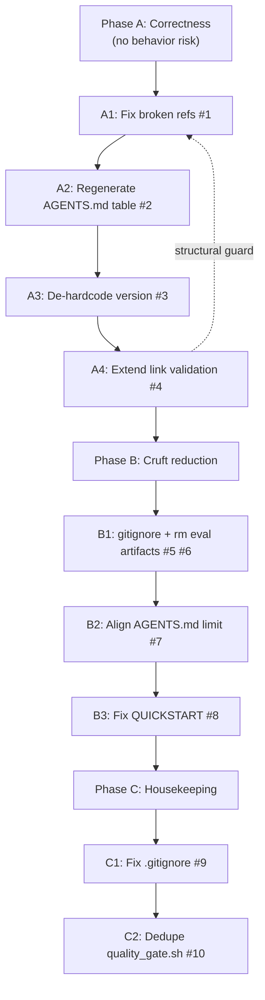

# Codebase Improvement Plan

> Status: Proposed · Date: 2026-07-05 · Owner: unassigned
> CI state at analysis time: **passing** (`.github/ci-status/ci-status.json`, run 27771228314).
> Scope: analysis + plan only. **No source files are modified by this task.**

## Context

This repository is a **GitHub template** intended to be cloned by other projects.
That changes the bar for correctness and consistency: broken references, dead
files, and conflated concepts are not internal debt — they are inherited by every
downstream consumer on `Use this template` / `git clone`. The plan below
prioritizes issues that propagate, then internal hygiene.

The harness enforces a strong convention: `AGENTS.md` is the single source of
truth, `VERSION` is the single version source, and skills live canonically under
`.agents/skills/`. Several findings are direct violations of those rules.

## Goals

1. Eliminate inherited drift (broken references, conflated versions, incomplete
   canonical tables).
2. Close validation gaps that let drift pass CI while it reports "passing".
3. Remove cruft consumers clone (eval artifacts, orphaned dirs, stale docs).
4. Realign documented constants with the codebase's own rules.

## Non-goals

- Restructuring skills or renaming them.
- Changing the template-vs-project version model (flagged as an open question).
- Implementing any fix — this document is the deliverable.

## Findings

| # | Severity | Finding | Primary evidence |
|---|----------|---------|------------------|
| 1 | HIGH | Broken references to non-existent skills `task-decomposition` and `github-readme` | `README.md:128,187,189`; `scripts/generate-llms-txt.sh:146`; `llms.txt:25` |
| 2 | HIGH | `AGENTS.md` Skills table lists only 1 category / 9 skills | `AGENTS.md:151-155` vs `agents-docs/AVAILABLE_SKILLS.md` (16 categories) |
| 3 | HIGH | Version "single source of truth" violated across 4 surfaces | `VERSION`=0.0.0; `README.md:7` badge 0.2.10; `scripts/agent-toolkit.sh:6` |
| 4 | HIGH | Link validation does not cover top-level docs | `scripts/validate-links.sh` walks only `.agents/skills/**/SKILL.md` |
| 5 | MED | 353 committed eval-workspace files; 2 orphaned dirs | `git ls-files` = 294 (`*-workspace`) + 59 (`skills-evaluation`) |
| 6 | MED | `skills-evaluation/` masquerades as a skill | no `SKILL.md`; name collides with `skill-evaluator` |
| 7 | MED | `AGENTS.md` line-limit guidance conflicts | constant=200, README=200, CONTRIBUTING=150, actual=155 |
| 8 | MED | QUICKSTART "Expected output" is stale vs `bootstrap.sh` | `QUICKSTART.md:32-33` vs `bootstrap.sh:37,41` |
| 9 | LOW | `.gitignore` malformed pattern + duplicates | `.gitignore:66`, dups at `31/44`, `32/45`, `34/54` |
| 10 | LOW | `quality_gate.sh` duplicate comment block | `scripts/quality_gate.sh:11-13` and `15-16` |

## Detail and proposed fix per finding

### 1. HIGH — Broken references to `task-decomposition` and `github-readme`

These skills do not exist. The real equivalents are `goap-agent`
(task-decomposition role) and `readme-best-practices` (github-readme role).

**Affected files (relative paths):**

- `README.md:128` — `.agents/skills/task-decomposition/` in "what this looks like in practice"
- `README.md:187,189` — `task-decomposition/` and `github-readme/` in the Skills progressive-disclosure example
- `scripts/generate-llms-txt.sh:146` — **hardcoded** `task-decomposition`, so every regeneration re-emits the broken link into `llms.txt:25` and `llms-full.txt`
- `llms.txt:25`, `llms-full.txt` — generated outputs carrying the broken link
- `agents-docs/MIGRATION.md`
- `examples/triz-swarm-migration.md`
- `plans/monthly-eval-schedule.md`
- `.agents/skills/intent-classifier/references/skill-catalog.md` — references **both** names
- `.agents/skills/triz-analysis/SKILL.md`
- `.agents/skills/ui-ux-optimize/references/swarm-coordination.md`

**Fix:** Replace `task-decomposition` -> `goap-agent` (or `intent-classifier`
where the intent is task breakdown), and `github-readme` ->
`readme-best-practices`. Update the hardcoded list in
`scripts/generate-llms-txt.sh:146`, then regenerate `llms.txt` and
`llms-full.txt` via `./scripts/generate-llms-txt.sh`.

### 2. HIGH — `AGENTS.md` Skills table is incomplete

`AGENTS.md:151-155` lists **only the Quality category (9 skills)**. The
catalog has ~55 skills across 16 categories (`agents-docs/AVAILABLE_SKILLS.md`).
The file billed as the single source of truth an agent reads at startup does
not surface `goap-agent`, `git-github-workflow`, `delegate`, `implementer`,
`learn`, `triz-analysis`, `triz-solver`, `codacy`, `cicd-pipeline`,
`security-code-auditor`, etc.

**Fix:** Regenerate the table from the catalog using the existing
`scripts/update-agents-md.sh` / `scripts/update-agents-registry.sh` so it
lists all categories, and ensure regeneration is part of the docs-sync step
so it cannot silently drift again.

### 3. HIGH — Version single-source-of-truth violation

`AGENTS.md:67-69` declares `VERSION` the single source and bans hardcoded
values, yet:

- `VERSION` = `0.0.0`
- `README.md:7` — hardcoded badge `version-0.2.10`
- `scripts/agent-toolkit.sh:6` — hardcoded `VERSION="0.0.0"`
- skill frontmatter across the catalog — `version: "0.2.10"`

Two version concepts (the *template* version `0.2.10` vs the
*consuming-project* placeholder `0.0.0`) are conflated, and consumers cannot
tell which is which.

**Fix:** Make the README badge read from the template-version source (or
`CHANGELOG-TEMPLATE.md`) via the existing `propagate-version.sh` /
`bump_patch_version.sh`. Have `agent-toolkit.sh` read the `VERSION` file
instead of hardcoding. Document the template-vs-project version distinction
in `agents-docs/VERSION.md`.

### 4. HIGH — Link validation gap

`scripts/validate-links.sh` only walks `SKILL.md` files under
`.agents/skills/`. `README.md`, `QUICKSTART.md`, `AGENTS.md`, `llms*.txt`,
and `agents-docs/*.md` are not link-checked — which is exactly why finding #1
persists while CI reports "passing".

**Fix:** Extend `validate-links.sh` (or add a sibling check in
`quality_gate.sh`) to resolve relative markdown links in top-level docs and
`agents-docs/`. This is the structural guard that prevents recurrence of #1.

### 5. MED — Committed eval-workspace artifacts + 2 orphaned dirs

`git ls-files` shows **294** files under `.agents/skills/*-workspace/` and
**59** under `.agents/skills/skills-evaluation/` — eval sample outputs
(`with_skill` / `without_skill` / `outputs/response.md`). Every consumer
clones this noise. `.gitignore` does not exclude `*-workspace/`.

Two workspace dirs are **orphaned** (their skills were renamed/removed):

- `anti-ai-slop-workspace` (skill is now `avoid-ai-writing`)
- `codacy-cloud-cli-workspace` (skill is now `codacy`)

**Fix:** Add `.agents/skills/*-workspace/` and
`.agents/skills/skills-evaluation/` to `.gitignore`; `git rm --cached` the
committed artifacts; delete the 2 orphaned dirs. Keep eval evidence out of the
consumable template (the skill-evaluator can write to a gitignored path or a
separate evals repo).

### 6. MED — `skills-evaluation/` masquerades as a skill

It has no `SKILL.md` (only `iteration-*/` dirs) yet sits alongside real
skills, and its name collides with the real `skill-evaluator` skill.
`validate-skills` / counting treats it ambiguously.

**Fix:** Remove/relocate it (covered by #5) and ensure skill-directory
detection requires a `SKILL.md`.

### 7. MED — `AGENTS.md` line-limit guidance conflicts

- `AGENTS.md:11` — constant `MAX_LINES_AGENTS_MD=200`
- `README.md:124` — "200/AGENTS.md"
- `CONTRIBUTING.md:249` — "Keep `AGENTS.md` under **150** lines"
- Actual file — 155 lines (under 200, over 150)

**Fix:** Pick one threshold. 200 matches the named constant (the repo's own
convention), so update `CONTRIBUTING.md` to 200.

### 8. MED — Stale QUICKSTART "Expected output"

`QUICKSTART.md:32-33` shows `==> Installing pre-commit hook` /
`pre-commit hook installed`, but `bootstrap.sh:37,41` actually prints
`==> Configuring git hooks via .githooks` /
`git hooks configured (core.hooksPath = .githooks)`. The documented bootstrap
flow diverged from the script.

**Fix:** Update the QUICKSTART expected-output block to match `bootstrap.sh`.

### 9. LOW — `.gitignore` malformed pattern + duplicates

- `.gitignore:66` — `commit*.txt.mimocode/` is a single glob that almost never
  matches; the intent was clearly `commit*.txt` + `.mimocode/` (the latter is
  already on the next line, making this both buggy and redundant).
- Duplicates: `*.swp` (lines 31 & 44), `*.swo` (32 & 45), `.coverage` (34 & 54).

**Fix:** Replace line 66 with `commit*.txt`; dedupe the repeated entries.

### 10. LOW — `quality_gate.sh` duplicate comment block

`scripts/quality_gate.sh:11-13` and `15-16` both have
`# --- Configuration ---` / `# Use named constants for common exclusions`.
Dead/duplicated comment.

**Fix:** Remove the second block.

## Phased remediation



> Dependency note: **A4 (extend link validation) is the structural guard for
> A1.** Implementing A4 first (or alongside A1) prevents the broken references
> from recurring. The dashed arrow shows A4 re-validating A1.

### Phase A — Correctness

| Step | Finding | Commit type | Suggested subject | Validate after |
|------|---------|-------------|-------------------|----------------|
| A1 | #1 | `docs` | `docs: fix broken task-decomposition/github-readme skill refs` | `./scripts/generate-llms-txt.sh`; diff `llms*.txt` |
| A2 | #2 | `docs` | `docs: regenerate AGENTS.md skills table from catalog` | `./scripts/update-agents-registry.sh` |
| A3 | #3 | `fix` | `fix(version): de-hardcode version in README badge and agent-toolkit` | `./scripts/propagate-version.sh` |
| A4 | #4 | `feat` | `feat(validate): link-check top-level docs and agents-docs` | `./scripts/validate-links.sh`; `./scripts/quality_gate.sh` |

### Phase B — Cruft reduction

| Step | Finding | Commit type | Suggested subject | Validate after |
|------|---------|-------------|-------------------|----------------|
| B1 | #5, #6 | `chore` | `chore: gitignore eval workspaces; remove committed artifacts` | `git status`; `./scripts/validate-skills.sh` |
| B2 | #7 | `docs` | `docs: align AGENTS.md line-limit guidance to 200` | `markdownlint-cli2 "**/*.md"` |
| B3 | #8 | `docs` | `docs: sync QUICKSTART bootstrap output with bootstrap.sh` | `markdownlint-cli2 "**/*.md"` |

### Phase C — Housekeeping

| Step | Finding | Commit type | Suggested subject | Validate after |
|------|---------|-------------|-------------------|----------------|
| C1 | #9 | `chore` | `chore: fix .gitignore malformed pattern and dedupe` | `git check-ignore -v <sample>` |
| C2 | #10 | `chore` | `chore: remove duplicate comment block in quality_gate.sh` | `shellcheck scripts/quality_gate.sh` |

## Validation strategy

After each phase:

```bash
./scripts/quality_gate.sh        # aggregate gate
./scripts/validate-skills.sh     # skill/symlink integrity
./scripts/validate-links.sh      # extended after A4 to cover top-level docs
./scripts/generate-llms-txt.sh   # regenerate, then diff llms*.txt
```

Conventional Commits are CI-enforced (ADR-008); validate a subject before
committing:

```bash
echo "docs: fix broken skill refs" | npx commitlint --config commitlint.config.cjs
```

## Assumptions

- The `goap-agent` skill is the intended successor to `task-decomposition`
  and `readme-best-practices` to `github-readme`. Confirm before A1.
- 200 lines is the intended `AGENTS.md` ceiling (matches the named constant).
- Eval workspaces are regenerable by `skill-evaluator` and do not need to be
  version-controlled in the consumable template.

## Open questions

1. **Version model**: Should the template carry its own version
   (`0.2.10` from `CHANGELOG-TEMPLATE.md`) distinct from the consuming
   project's `VERSION` (`0.0.0`)? If yes, document the two-track model in
   `agents-docs/VERSION.md` and stop the README badge from touching `VERSION`.
2. **Eval evidence**: Keep eval workspaces in-repo (gitignored) or move to a
   separate evals repository? Affects B1 scope.
3. **AGENTS.md table**: Should the canonical skills table be auto-generated
   on every docs-sync (making A2 self-healing), or regenerated on demand?

## See also

- `agents-docs/AVAILABLE_SKILLS.md` — full skill catalog (16 categories).
- `agents-docs/VERSION.md` — version management reference.
- `AGENTS.md` — single source of truth (Code Style, Version Management).
- `plans/adr-008-enforce-conventional-commits.md` — commit-message rules.
